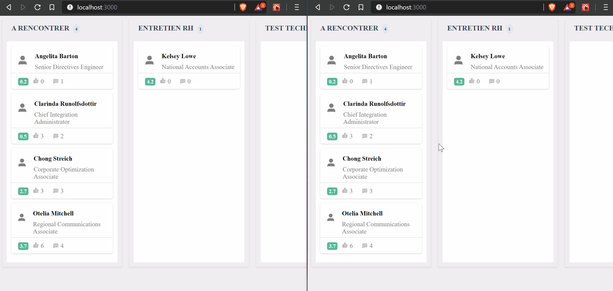

*Ruby on Rails 6 with ReactJS front - Testing Action Cable with fancy drag and drop*

Using Rails 6, actionecable and ReactJS with react-beautiful-dnd library, we will build a Trello-like poc.

Here the result :

 Quickstart
====================

Git clone
---------
git clone https://github.com/antoineBernard/dnd-actioncable-rails6.git

RVM install
---------

* Bash : `curl -sSL https://get.rvm.io | bash -s stable --ruby`

Install ruby 2.7.0 (with RVM)
---------
	rvm list
	rvm install 2.7.0
	rvm use 2.7.0

Install Postgresql and start service
---------
* MacOS
   brew install postgresql
   brew services start postgresql

* Linux
  sudo apt-get install postgres libpq-dev
  sudo service postgresql start

Install Bundle
---------
	gem install bundler
	bundle install

Install Yarn
---------
	brew install yarn
	yarn install

Configure database.yml
---------
* Copy .database.yml.example in database.yml (create a new file)
* In database.yml replace YOUR USERNAME and YOUR PASSWORD with postgres user with creation right.
  To see users in postgresql :
    - psql postgres
    - \du

Create database
---------
    rails db:create
    rails db:migrate

Create fake data
---------
    rails db:seed

Run local server
---------
    rails s

Then look on localhost:3000 !

Run all tests and all linters
---------
    sh alltests

Run linters (Rubocop and EsLint)
---------
    sh alllinters
